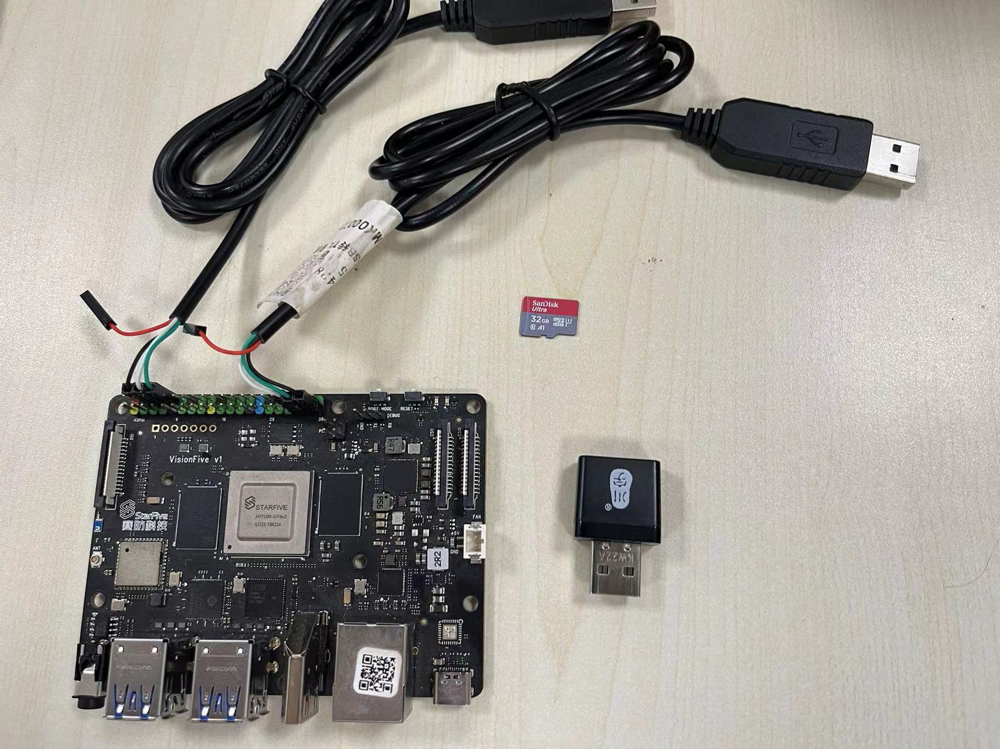
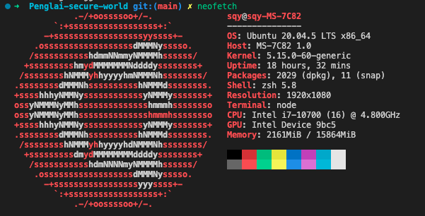
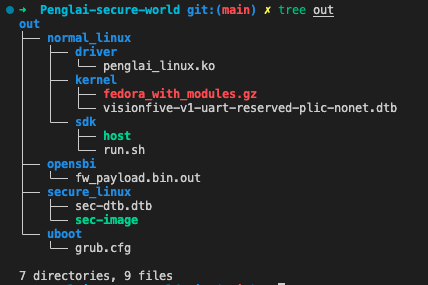
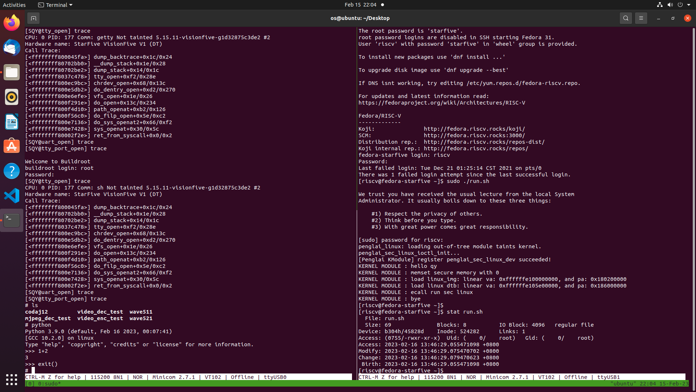
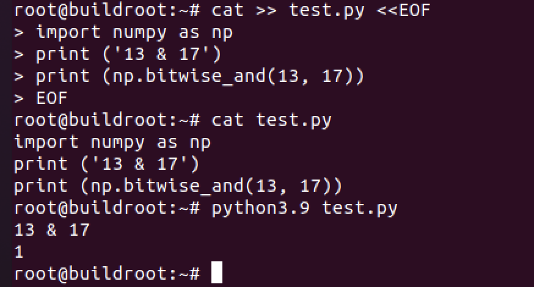
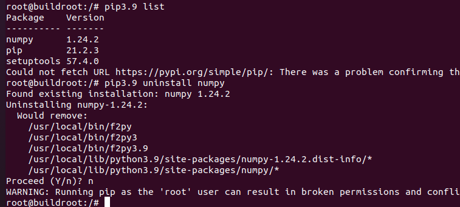

# Penglai-secure-world

## RISC-V TEE 安全/非安全世界模型

实现安全/非安全世界间内存隔离，为安全世界提供设备安全能力。在安全世界中运行Linux，从而实现对现有成熟Linux程序的后向兼容。


## 仓库结构

需要编译的 Artifacts 包括 Visionfive V1 开发板上除 secondBoot 和 ddrinit 外的所有软件，下图显示了主代码仓库Penglai-secure-world的目录结构，接下来将根据启动顺序依次介绍代码仓库和编译对象间的对应关系：

```
➜  Penglai-secure-world git:(main) ✗ tree
.
├── starfive-normal-linux
├── starfive-penglai
│   ├── conf
│   ├── docs
│   ├── openEuler-files
│   ├── openeuler-kernel
│   ├── opensbi-0.9
│   ├── patches
│   ├── penglai-enclave-driver
│   ├── penglai-selinux-driver
│   ├── penglai-selinux-sdk
│   ├── riscv-qemu
│   ├── scripts
│   └── sdk
├── starfive-secure-linux
│   ├── bsp
│   ├── buildroot
│   ├── conf
│   ├── HiFive_U-Boot
│   ├── linux
│   ├── opensbi
│   └── soft_3rdpart
└── starfive-uboot
```
- secondBoot 和 ddrinit 直接使用赛昉预编译好的可执行文件，文件下载以及烧录、重置等相关操作请参考[VisionFive Single Board Computer Quick Start Guide.pdf](https://starfivetech.com/uploads/VisionFive%20Single%20Board%20Computer%20Quick%20Start%20Guide.pdf)
- OpenSBI & u-boot 是实施了 domain 机制，添加了蓬莱 Secure monitor 的，分别对应子仓库starfive-penglai/opensbi-0.9 和 starfive-uboot，从源码编译请参考[VisionFive Single Board Computer Software Technical Reference Manual.pdf](https://starfivetech.com/uploads/VisionFive%20Single%20Board%20Computer%20Software%20Technical%20Reference%20Manual.pdf)，其编译产物为 firmware_payload.bin.out。
- Normal Linux 所需的内核镜像、设备树由子仓库starfive-normal-linux 编译得到，仍参考[VisionFive Single Board Computer Software Technical Reference Manual.pdf](https://starfivetech.com/uploads/VisionFive%20Single%20Board%20Computer%20Software%20Technical%20Reference%20Manual.pdf)，编译产物为fedora_with_modules.gz和visionfive-v1-uart-reserved-plic-nonet.dtb。
- Normal Linux 用于加载 Secure Linux 的内核驱动和用户态程序将从子仓库starfive-penglai编译，分别对应penglai-selinux-driver和penglai-selinux-sdk这两个目录，编译产物为penglai_linux.ko 和host。
- Secure Linux 对应子仓库starfive-secure-linux，其内核镜像和设备树从目录starfive-secure-linux/linux编译，其 initramfs 从目录starfive-secure-linux/buildroot编译并打包在内核镜像中，编译产物为sec-image 和 sec-dtb.dtb。

## 运行测试

介绍在赛昉VisionFive v1开发板上的部署并测试的过程。

### 一、工具与环境准备

#### 硬件
如下图，硬件需要两个串口转换器，分别连接板上的UART3和UART1，参考[StarFive 40-Pin GPIO Header User Guide](https://doc-en.rvspace.org/General/PDF/StarFive_40-Pin_GPIO_Header_UG.pdf)完成接线，同时还需要一张SD卡和一个SD卡读卡器。主机软件可使用minicom 来连接串口。



#### 软件环境
使用 Ubuntu 20.04.5 LTS x86_64 作为编译和制作SD卡的软件环境，如图所示：



### 二、代码仓库初始化

克隆代码仓库，更新子模块，并安装编译所需依赖。项目编译后约20G，请留意磁盘空间。
```
git clone https://github.com/Shang-QY/Penglai-secure-world.git
cd Penglai-secure-world
git submodule update --init --recursive
```
```
sudo apt update
sudo apt upgrade
sudo apt-get install autoconf automake autotools-dev bc bison xxd \
build-essential curl flex gawk gdisk git gperf libgmp-dev \
libmpc-dev libmpfr-dev libncurses-dev libssl-dev libtool \
patchutils python screen texinfo unzip zlib1g-dev device-tree-compiler libyaml-dev
```
设置后续操作中要使用的、代表仓库根目录的环境变量。
```
export SECURE_WORLD_DIR=$(pwd)
```

### 三、编译

一键编译所有软件模块，编译所需的时间较长。
```
./script/build_all.sh
```
在编译结束后，最终需要的编译产物被放在`out`目录下，结构如下所示：



### 四、制作SD卡

一键制作SD卡，将插有SD卡的读卡器连接到主机（Linux系统），确定SD卡对应的设备，图中SD卡对应的设备为`/dev/sda`：


执行脚本并以设备名为参数（执行过程较快，起初需要输入sudo密码）：
```
./script/make_sdcard.sh -d /dev/sda
```

### 五、安装软件到SD卡中

一键安装编译产物到SD卡中（除`fw_payload.bin.out`外），此过程非常快。
```
./script/install_all.sh -d /dev/sda
```

### 六、烧录固件

请参考[VisionFive Single Board Computer Quick Start Guide.pdf](https://starfivetech.com/uploads/VisionFive%20Single%20Board%20Computer%20Quick%20Start%20Guide.pdf)中的`Appendix B: Updating Firmware and u-boot`部分，烧录fw_payload.bin.out

### 七、启动运行

使用minicom分别连接好两个串口。根据赛昉引脚手册[StarFive 40-Pin GPIO Header User Guide](https://doc-en.rvspace.org/General/PDF/StarFive_40-Pin_GPIO_Header_UG.pdf)，可以看到UART3是ddrinit、secondboot、OpenSBI、U-boot所使用的串口，即系统启动早期输出将从UART3打印。之后Normal linux使用UART1作为串口设备启动，启动过程将将从UART1打印。后续被加载并启动的Secure linux则使用UART3作为串口设备。

上电，在UART1上看到Normal Linux 的启动过程，（使用用户名：riscv，密码：starfive）进入终端。执行：
```
sudo ./run.sh
```
之后将在UART3上看到Secure Linux 的启动过程，（使用用户名：root，密码：starfive）进入终端。接着在Secure Linux 的终端执行`python`即可进入python 命令行。

运行结果截屏如图所示：（左边是UART3串口-安全世界终端，右边是UART1串口-非安全世界终端）



## Python 运行环境集成

本节介绍Python包的安装、使用和静态集成方式，以`numpy`为例（numpy已安装好，可直接使用）。

### 一、定制你的编译运行环境

在源码目录`starfive-secure-linux/buildroot/customized_rootfs`中的`Makefile`中可见我们的编译运行环境是由这几层组成的：


不同环境以类似Docker Image的层叠方式组合在一起，通过修改`Makefile`进行定制。请注意层叠顺序，后解压的会覆盖先前已有的同名文件。

### 二、在主根目录与编译运行环境间切换

请务必挂载特殊的系统目录到编译运行环境，否则会出错。使用chroot命令进入编译运行环境。
```
mount --bind /dev /root/penglai_rootfs/dev
mount --bind /sys /root/penglai_rootfs/sys
mount --bind /proc /root/penglai_rootfs/proc

chroot /root/penglai_rootfs/ bash
```

在编译运行环境中使用exit命令退出并回到进入前所在的目录。
```
exit
```

### 三、安装和使用Python包

假设已经进入编译运行环境，Python安装在编译运行环境的usr/local/bin/目录下，需添加到环境变量中：

```
export PATH=$PATH:/usr/local/bin/
python3.9 --version
pip3.9 --version
```

#### 安装
Buildroot默认系统时间为1970年，使用date指令重设系统时间：

```
date -s 2022-03-01
```

使用pip安装包（由于不支持ssl所以需对包源添加`--trusted-host`参数），等待直到安装完成。
```
pip3.9 install --trusted-host pypi.org --trusted-host pypi.python.org --trusted-host files.pythonhosted.org numpy
```

#### 使用
运行简单的numpy应用程序进行测试：

```
cat >> test.py <<EOF
import numpy as np
print ('13 & 17')
print (np.bitwise_and(13, 17))
EOF

python3.9 test.py
```




### 四、定位相关包文件并拷贝到源码目录

以将numpy包拷贝到源码目录为例：

```
pip3.9 list
pip3.9 uninstall numpy
```



如图，可以看到numpy包的相关文件包括，我们切换到主根目录并使用tar指令打包。注意打包需在penglai_rootfs目录下，以使包中目录结构与源码目录一致，便于后续集成。

```
cd penglai_rootfs

tar -cf numpy_module.tar usr/local/bin/f2py* usr/local/lib/python3.9/site-packages/numpy*
```

可以在主根目录下解压以查看内容：

```
mv numpy_mudule.tar .. && cd ..
tar -xf numpy_module.tar
```

使用scp指令拷贝到源码目录（请事先在源码目录中创建用于保存压缩包的目录，示例中该目录为`customized_rootfs/layers/numpy`）：

```
scp numpy_module.tar <username>@<hostname>:<Penglai-secure-world DIR>/starfive-secure-linux/buildroot/customized_rootfs/layers/numpy/
```


### 五、静态集成Python包

假设已添加到`customized_rootfs/layers/numpy`目录，这时可以修改Makefile以在编译运行环境中集成新的环境（也就是添加图中画线的这行）：


在主仓库目录重新编译即可。
